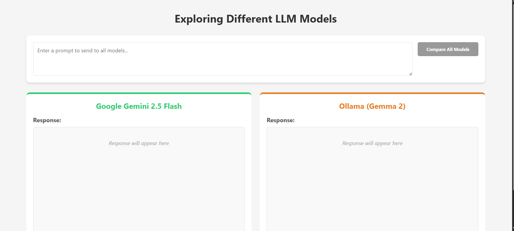
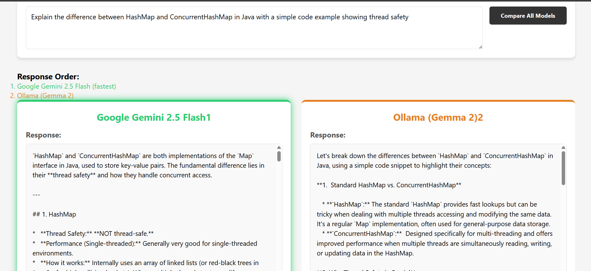
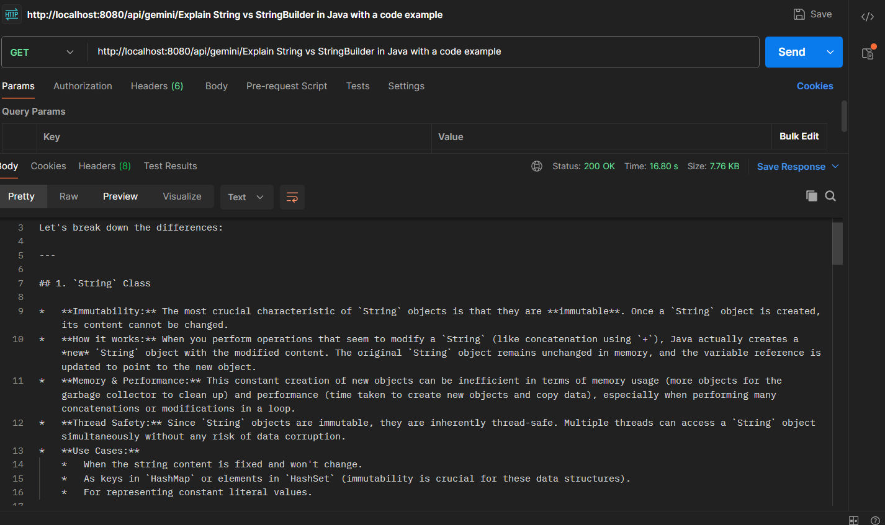

# 🚀 AI Model Comparison

<div align="center">

# 🤖 AI Model Comparison Platform

### Compare Responses from Multiple Large Language Models (LLMs) using Spring AI

<p align="center">


</p>

</div>

---

# 📖 Overview

AI Model Comparison is a full-stack AI application built using **Spring Boot**, **Spring AI**, **React**, and **Vite** that allows users to compare responses generated by multiple Large Language Models (LLMs) from a single interface.

The application sends the same prompt to different AI models and displays their responses side by side, making it easy to compare answer quality, speed, reasoning, and response style.

Currently, the project integrates:

- Google Gemini API
- Ollama Local Models
- Gemma 2 (Local)

This project demonstrates practical implementation of Spring AI with multiple providers and showcases how different AI models respond to the same question.

The frontend provides a clean and responsive interface where users can enter a prompt, select the comparison order, and instantly receive responses from multiple AI models.

This project follows a clean backend architecture and can be extended easily by integrating additional LLM providers such as OpenAI, Anthropic Claude, Mistral AI, Groq, DeepSeek, Azure OpenAI, and more.

---

# ✨ Features

## 🤖 AI Model Comparison

- Compare Multiple AI Models
- Same Prompt for Every Model
- Side-by-Side Response Comparison
- Response Order Selection
- Fast AI Response Display

---

## 🌐 Google Gemini Integration

- Google Gemini API
- Spring AI Integration
- Cloud-based AI Responses
- High-quality Reasoning
- Natural Language Generation

---

## 💻 Ollama Local AI

- Local LLM Support
- Gemma 2 Model
- Offline AI Processing
- Privacy Friendly
- No Cloud Dependency

---

## 🎨 Frontend Features

- Modern React UI
- Responsive Design
- Interactive Layout
- Loading Indicators
- Simple Prompt Input
- Compare Button
- Beautiful Result Cards

---

## ⚙ Backend Features

- Spring Boot REST API
- Spring AI
- RESTful Architecture
- Layered Design
- CORS Configuration
- Multiple AI Endpoints
- Easy Model Integration

---

# 🛠 Tech Stack

| Technology | Used |
|------------|------|
| Java 21 | ✅ |
| Spring Boot 3.5 | ✅ |
| Spring AI | ✅ |
| Google Gemini API | ✅ |
| Ollama | ✅ |
| Gemma 2 | ✅ |
| React 19 | ✅ |
| Vite | ✅ |
| Maven | ✅ |
| REST API | ✅ |

---

# 🧩 Project Architecture

```text
                User

                  │

                  ▼

          React Frontend (Vite)

                  │

      HTTP REST API Request

                  │

                  ▼

        Spring Boot Backend

                  │

        Spring AI Framework

         ┌────────┴────────┐

         ▼                 ▼

 Google Gemini API     Ollama

                            │

                            ▼

                      Gemma 2 Model
```

---

# 🚀 AI Workflow

```text
User Prompt

      │

      ▼

React Frontend

      │

      ▼

Spring Boot API

      │

      ▼

Spring AI

      │

 ┌────┴─────┐

 ▼          ▼

Gemini   Ollama

 ▼          ▼

Responses Generated

      │

      ▼

Frontend Comparison Screen
```

---

# 📡 REST API Endpoints

## 🤖 Google Gemini API

| Method | Endpoint | Description |
|---------|----------|-------------|
| GET | `/api/gemini?message=` | Generate response using Google Gemini |

---

## 💻 Ollama API

| Method | Endpoint | Description |
|---------|----------|-------------|
| GET | `/api/ollama/{message}` | Generate response using Ollama Local Model |

--- 

---

# 📂 Project Structure

```text
AI-Model-Comparison
│
├── backend
│   └── SpringAIDemo
│       ├── src
│       │   ├── main
│       │   │   ├── java
│       │   │   │   └── com.aiproject.SpringAIDemo
│       │   │   │       ├── GeminiController
│       │   │   │       ├── OllamaController
│       │   │   │       └── SpringAiDemoApplication
│       │   │   └── resources
│       │   │       └── application.properties
│       │   └── test
│       └── pom.xml
│
├── frontend
│   └── llm-comparison-ui-master
│       ├── src
│       ├── public
│       ├── package.json
│       └── vite.config.js
│
└── README.md
```

---

# ⚙️ Getting Started

## 1️⃣ Clone Repository

```bash
git clone https://github.com/jeevan-kaware/AI-Model-Comparison.git
```

```bash
cd AI-Model-Comparison
```

---

# 📦 Backend Setup

Move to the backend directory.

```bash
cd backend/SpringAIDemo
```

Run the application.

```bash
./mvnw spring-boot:run
```

or

```bash
mvn spring-boot:run
```

The backend will start on

```text
http://localhost:8080
```

---

# 💻 Frontend Setup

Move to the frontend directory.

```bash
cd frontend/llm-comparison-ui-master
```

Install dependencies.

```bash
npm install
```

Run the frontend.

```bash
npm run dev
```

The frontend will start on

```text
http://localhost:5173
```

---

# 🔑 Configure Google Gemini API

Generate your Gemini API Key from Google AI Studio.

Update your **application.properties**

```properties
spring.ai.google.genai.api-key=YOUR_GEMINI_API_KEY

spring.ai.google.genai.chat.options.model=gemini-2.5-flash
```

---

# 🦙 Configure Ollama

Download Ollama

https://ollama.com/download

Install Gemma 2

```bash
ollama pull gemma2:2b
```

Run the model.

```bash
ollama run gemma2:2b
```

Verify Ollama is running.

```bash
http://localhost:11434
```

---

# ⚙ application.properties

```properties
spring.application.name=SpringAIDemo

server.port=8080

spring.ai.google.genai.api-key=YOUR_GEMINI_API_KEY

spring.ai.google.genai.chat.options.model=gemini-2.5-flash

spring.ai.ollama.base-url=http://localhost:11434

spring.ai.ollama.chat.options.model=gemma2:2b
```

---

# 📚 Maven Dependencies

Main libraries used in this project

- Spring Boot Starter Web
- Spring AI
- Google Gemini Starter
- Ollama Starter
- Maven
- Spring Boot Test

---

# 🌍 API Examples

## Google Gemini

```http
GET /api/gemini?message=Explain Spring Boot
```

Response

```json
Spring Boot is a Java framework that simplifies application development...
```

---

## Ollama

```http
GET /api/ollama/Explain Spring Boot
```

Response

```json
Spring Boot helps developers build Java applications quickly...
```

---

# 🚀 How the Comparison Works

```text
User enters a prompt

        │

        ▼

Frontend sends request

        │

        ▼

Spring Boot receives request

        │

        ├───────────────┐

        ▼               ▼

Google Gemini      Ollama

        ▼               ▼

Generate Response  Generate Response

        └──────┬────────┘

               ▼

Frontend displays comparison
```

---

# ✨ Highlights

- Spring AI Integration
- Multiple AI Providers
- Google Gemini API
- Ollama Local LLM
- Gemma 2 Model
- Clean REST API
- React Frontend
- Responsive UI
- Easy to Extend
- Production Ready Structure

---
---

# 📸 Screenshots

The following screenshots demonstrate the complete workflow of the AI Model Comparison application.

---

## 🏠 Home Page



---

## 🤖 Compare Multiple Models



---

## ⚡ Google Gemini Response



---

## 🦙 Ollama (Gemma 2) Response


---

## 🔀 Response Order Selection


---

## 📝 Prompt Input


---

## 📊 Compare All Models


---

## 🌐 Responsive UI


---

## ⚙️ Spring Boot Backend


---

## 📄 API Testing


---

# 🧠 AI Workflow

```text
User Prompt
      │
      ▼
React Frontend
      │
      ▼
Spring Boot REST API
      │
      ├────────► Google Gemini API
      │
      └────────► Ollama (Local Gemma 2)
                  │
                  ▼
Compare Responses
                  │
                  ▼
Display Results on UI
```

---

# 📂 Project Structure

```text
AI-Model-Comparison
│
├── backend
│   └── SpringAIDemo
│       ├── src
│       │   ├── controller
│       │   ├── service
│       │   ├── config
│       │   ├── dto
│       │   ├── resources
│       │   └── SpringAiDemoApplication
│       ├── pom.xml
│       └── mvnw
│
├── frontend
│   └── llm-comparison-ui-master
│       ├── src
│       │   ├── components
│       │   ├── pages
│       │   ├── assets
│       │   └── App.jsx
│       ├── package.json
│       └── vite.config.js
│
├── screenshots
└── README.md
```

---

# 📖 Learning Outcomes

This project helped me gain practical experience with:

- Java 21
- Spring Boot
- Spring AI
- REST API Development
- AI Prompt Engineering
- Google Gemini API
- Ollama Local LLM
- Gemma 2 Model
- TinyLlama Model
- React.js
- Vite
- Axios
- CORS Configuration
- Maven
- Layered Architecture
- Environment Variables
- API Integration
- LLM Comparison Techniques
- AI Application Development

---

# 🚀 Future Improvements

- GPT-4.1 Integration
- Claude Integration
- DeepSeek Integration
- Mistral Integration
- Llama 3 Integration
- Streaming Responses
- Chat History
- Markdown Rendering
- Code Syntax Highlighting
- Authentication
- Docker Support
- Kubernetes Deployment
- CI/CD Pipeline
- Cloud Deployment
- AI Response Export
- Image Generation Support

---

# 🤝 Contributing

Contributions are welcome!

If you would like to improve this project:

1. Fork the repository
2. Create a new feature branch
3. Commit your changes
4. Push your branch
5. Open a Pull Request

---

# 👨‍💻 Author

## Jeevan Kaware

**Java Backend Developer | Spring Boot Developer | AI Enthusiast**

### 🔗 GitHub

https://github.com/jeevan-kaware

### 📂 Project Repository

https://github.com/jeevan-kaware/AI-Model-Comparison

### 💼 LinkedIn

https://www.linkedin.com/in/jeevan-kaware-080643355

### 🌐 Portfolio

Coming Soon...

---

# ⭐ Support

If you found this project helpful, please consider giving it a ⭐ on GitHub.

It motivates me to build more production-ready Java Backend and AI projects.

---

<div align="center">

## 🚀 Built with Java, Spring Boot, Spring AI, Google Gemini, Ollama, React, Vite and ❤️

### Thank you for visiting this repository!


</div>
